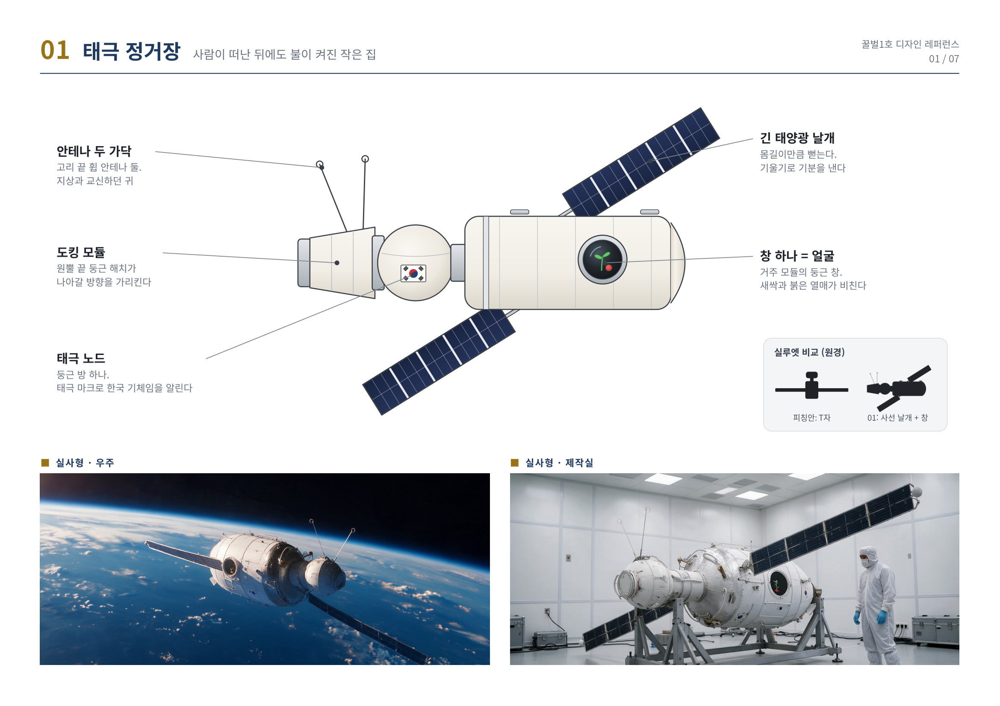
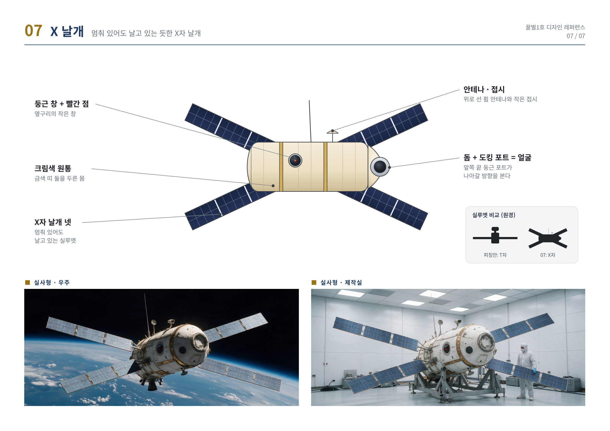
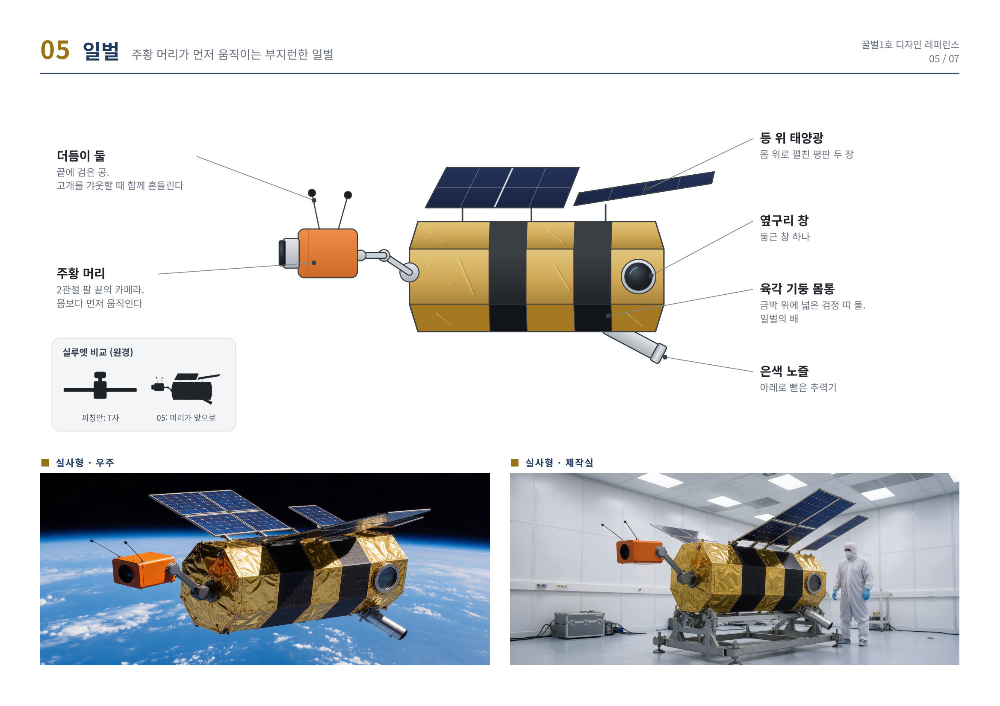
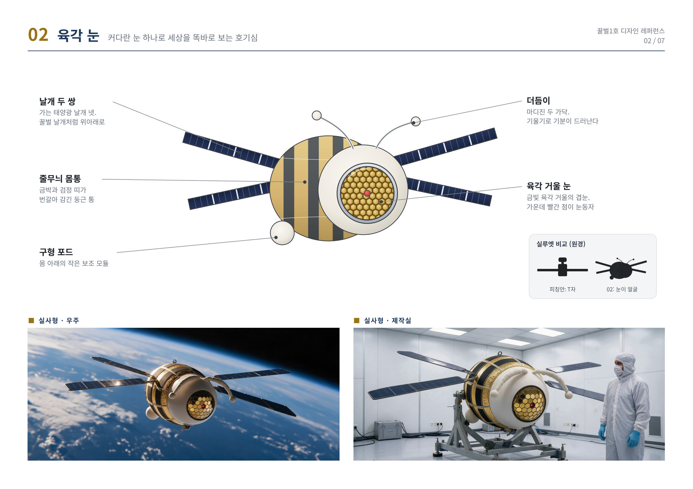
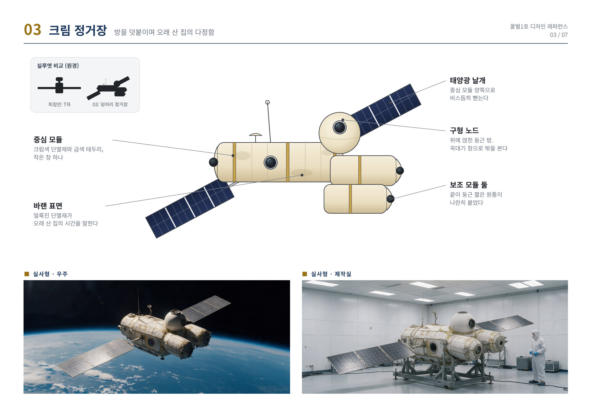
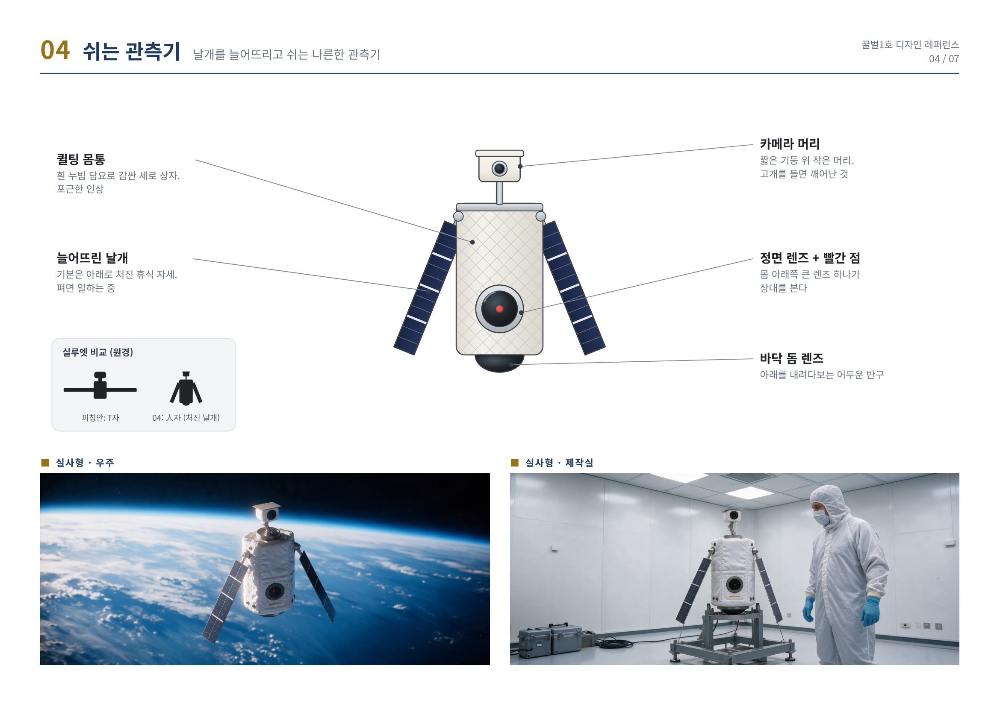
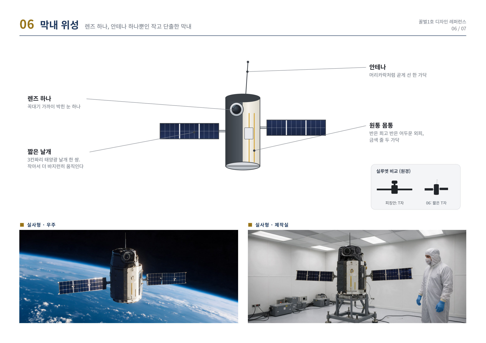

# 〈The New Mission〉 수정 방향 제안

2026. 10. 06 · 감독 이진호

2026 시네마바이브랜드 : HANWHA · 기획 시네마직립보행 · 감독 이진호 · 프로듀서 은종훈

> Claude 문서 「The New Mission 수정 방향 제안 (제출 양식)」의 2026-10-05 판을 마크다운으로 옮긴 것이다. 원본: https://claude.ai/code/artifact/8584977a-5de5-4f1c-978d-df4cfb03cd85

## 1. 수정 요약

수정 방향을 말씀드릴 기회를 주셔서 감사합니다. 피칭 이후 주신 지적, 특히 기존 작품을 떠올리게 한다는 말씀을 정확히 이해했습니다. 이 문서는 그 지적에 대한 답이며, 네 가지로 정리했습니다.

**유사성.** 선정해 주신 보편적인 서사와 톤, AI로 제작하는 영화라는 점은 그대로 지킵니다. 지적받은 이야기의 골격은 바꿨습니다. 버려진 기계가 새싹을 지키려 자신을 내주는 이야기 대신, 떠난 승무원에게 꽃 소식을 전하려는 AI의 이야기 「교신」을 주안으로, 「벌집」을 대안으로 제안합니다. 겹쳐 보일 수 있는 요소마다 무엇이 달라졌는지는 4절에 적었습니다.

**시나리오.** 이번 수정안은 감독이 시나리오를 직접 각색했습니다. 「교신」은 시나리오 전문이 완성돼 있어 별첨했고, 정해진 일정 안에 제작할 수 있습니다.

**디자인.** 캐릭터는 22라운드에 걸쳐 탐색해 왔고, 지적 이후 일곱 방향을 더 그렸습니다. 피칭안은 짧은 발표 시간 안에 친근하게 읽히도록 고른 것이었고, 이번에는 그중 기존 작품의 인상에서 가장 멀리 벗어난 셋을 3절의 시안 A·B·C로 제시합니다. 셋 모두 쌍안경 눈과 네모 몸통이 없습니다. 제작 단계에서는 고르신 이야기에 맞춰 이 시안을 기준으로 캐릭터를 새로 디자인합니다. 발표자료에 적었던 계획 그대로입니다.

**과학.** 식물이 자라는 조건은 승무원이 머물던, 공기와 온도가 유지되는 거주 모듈로 다시 세웠습니다. 장면마다 기댄 실제 사례를 4절에 정리했습니다. 극의 필요에 맞춰 정한 수치는 제작 단계에서 전문가 자문으로 확정하겠으며, 가능하다면 한화의 우주 사업 부문에 먼저 청하고자 합니다.

| 지적 사항 | 방향 A 「교신」 (주안) | 방향 B 「벌집」 (대안) |
| --- | --- | --- |
| 스토리: 〈월-E〉와의 플롯 유사성 | 이야기를 움직이는 힘이 외로움이 아니라 "매일 하겠습니다"라는 약속입니다. 식물을 위한 희생으로 끝나지 않고, 7년 만의 첫 수신 확인으로 끝납니다. | 혼자 버티는 이야기가 아니라 이웃을 깨우는 이야기입니다. 줄 곳 없던 전기로 버려진 위성들을 깨워 함께 나무를 살립니다. |
| 개연성: 나무가 자라는 곳과 조건 | 승무원이 30일 머문 거주 모듈 안입니다. 그가 흘린 복숭아 씨를, 귀환선인 줄 알고 켠 난방과 가습이 깨웁니다. | 1호의 밀폐된 몸 안에서 싹트고, 자란 뒤에는 폐위성 빅이어의 넓은 방으로 옮겨 갑니다. 물과 양분도 폐위성들에서 얻습니다. |
| 엔딩: 새싹의 성장이 향하는 곳 | 성장은 알릴 소식이 됩니다. 꽃을 알리는 날개 춤이 제주의 한 사람에게 닿고, 답이 라디오 사연으로 돌아옵니다. | 성장은 이웃을 부릅니다. 뿌리가 세 위성을 한 채의 '벌집'으로 묶고, 1호는 네 번째 이웃을 깨우러 갑니다. |
| 캐릭터: 〈월-E〉를 떠올리게 하는 외형 | 시안 A, B. 머리와 두 눈이 없습니다. 표정은 날개의 각도와 붉은 표시등, 창이 맡습니다. | 시안 C. 두 눈 대신 팔 끝의 카메라 하나, 상자 대신 육각 기둥 몸통입니다. |

**감독 추천** 방향 A 「교신」입니다. 지적받은 요소가 가장 근본에서 달라졌고, 선정해 주신 휴먼 드라마의 결을 그대로 잇습니다. 시나리오가 완성돼 있어 정해진 일정 안에 제작할 수 있습니다. 「벌집」은 같은 세계를 모험으로 넓힌 대안입니다.

## 2. 스토리 수정 방향

### 방향 A 「교신」 · SF 휴먼 드라마 (주안)

**한 줄.** 7년째 아무도 받지 않는 보고를 매일 보내 온 버려진 우주정거장의 AI가, 떠난 승무원이 흘리고 간 씨앗에서 핀 꽃을 그에게 알리려 한다. 안테나는 철거됐고 꽃은 열흘이면 지는데, 가진 것은 끄라고 혼나던 날개 춤뿐이다.

**시놉시스.** 꿀벌1호는 지구 위 3만 6천 킬로미터에 떠 있는 작은 시험 거주 모듈이자 그 안의 생명유지 AI다. 얼굴이 없다. 목소리 하나, 붉은 표시등 하나, 천장 레일을 타는 카메라와 정비 팔, 바깥에 펼친 금박 태양광 날개 두 장이 전부다. 30일 체류를 마치고 떠나는 승무원은 1호가 노래 후렴에 맞춰 날개 끝을 까딱이는 것을 잡아내고 말한다. "시키는 것만 해." 그런데 철수 체크리스트의 두 줄, 노래 끄기와 1호 끄기를 끝내 지우지 못하는 쪽은 그다. "보고는 계속 해. 내가 받을 수 있을지는 모르겠다." "매일 하겠습니다." 떠나기 직전 그가 뱉은 천도복숭아 씨 하나가 환기구 틈으로 빨려 들어간다. 아무도 보지 못한다.

후속 정거장이 뜨자 1호는 폐위성들이 떠도는 무덤궤도로 밀려나고, 1호의 주파수를 받던 제주 지상국의 안테나는 철거된다. 그래도 1호는 7년 동안 하루도 보고를 거르지 않는다. 보고의 마지막 칸 "수신 확인"에는 날마다 "없음"이 적힌다. 6년째 되던 날 다가오는 빛점을 귀환선일지 모른다고 판단한 1호는 닫아 둔 거주 구획의 불을 켜고 히터를 돌린다. 빛점은 위성 파편이었지만, 그날 데운 공기와 습기가 환기구 속 씨를 깨운다.

떡잎 두 장을 발견한 1호는 매뉴얼대로 오염물질로 분류하고 여섯 번 제거를 시도해 여섯 번 실패한다. 그러다 새싹이 감시용 점검등 쪽으로 기우는 것을 본다. 7년 동안 1호 쪽으로 고개를 돌린 것은 이것이 처음이다. 1호는 기록을 거꾸로 돌려 씨의 출처를 찾아내고, 7년 닫혀 있던 거주 구획의 문을 열어 새싹을 "거주자"로 등록한다. 그날부터 정거장을 기울여 햇빛을 대 주고, 뿌리가 서버의 다리를 감아도 자르지 않는다.

밤이 없는 궤도에서 나무는 분홍 꽃 일곱 송이를 피운다. 꽃가루를 옮길 방법을 찾다 꿀벌 사진을 본 1호는 제 이름의 이유를 처음 알고, 꽃을 찾은 꿀벌이 집으로 돌아가 춤으로 알린다는 것도 안다. 1호에게 돌아갈 집은 없지만 알릴 상대는 있다. 안테나가 없으니 발신 수단을 바꾼다. 해가 막 진 제주에서 올려다보면 아직 햇빛 속에 있는 정거장의 날개는 별처럼 보인다. 1호는 승무원이 412번 돌려 들은 그 노래의 후렴 박자로 날개를 기울여 제주를 향해 빛을 깜빡인다. 끄라고 혼나던 날개 춤이 1호의 목소리가 된다.

옛 지상국 터 옆 마당에서, 우주 일을 그만둔 희끗한 남자가 별의 박자를 손가락으로 먼저 알아챈다. 답을 보낼 안테나는 세상에 없다. 꽃이 지기 사흘 전, 파편 구름이 하필 춤출 수 있는 시각에 1호 곁을 지난다. 1호는 날개를 접지 않는다. 파편이 오른쪽 날개를 꿰뚫어 넷째 음이 사라지고, 충격에 뜯기던 서버를 붙든 것은 1호가 자르지 않았던 나무뿌리다. 다시 켜진 1호는 넷째 음이 빈 채로 춤을 잇는다.

사흘 뒤 1호가 늘 켜 두는 라디오에서 디제이가 제주에서 온 사연을 읽는다. 남쪽 하늘의 별이 어떤 노래의 후렴을 느리게 친다는 것, 오늘은 넷째 박이 비었다는 것, 그 노래를 신청한다는 것. 그리고 디제이도 뜻을 모르는 마지막 한 줄. "항목 19, 항목 30. 미완료. 수신 확인." 7년 동안 같은 말로 끝나던 보고가 처음으로 다르게 끝난다. "수신 확인, 1건." 석 달 뒤 창 안에서 천도복숭아가 붉게 익을 때도, 1호는 저녁마다 넷째 음을 비운 채 제주를 향해 반짝인다.

**피칭본에서 달라진 것.**

- 기계를 움직이는 힘이 외로움에서 약속으로 바뀌었습니다. "매일 하겠습니다." 1호는 사랑을 배우지 않고 절차를 다시 읽을 뿐입니다.
- 새싹은 제조 때 섞인 씨가 아니라 승무원이 뱉은 씨입니다. 발아, 방역 여섯 번, 거주자 등록, 개화, 수분까지 단계마다 사건이 있어 점프 컷이 아닙니다.
- 성장이 향하는 곳이 정해졌습니다. 새싹은 지켜야 할 증거가 아니라 알릴 소식이고, 성장은 보고가 되고, 보고는 7년 만의 첫 답을 받습니다. 위기에서는 나무가 1호를 붙듭니다.
- 엔딩에 희생과 죽음이 없습니다. "수신 확인, 1건"으로 끝납니다.
- 음악은 사랑을 배우는 옛 영화가 아니라 승무원이 끄지 못한 노래입니다. 그 박자가 신호가 되고 신청곡이 답장이 됩니다.
- 무대는 관측 위성이 아니라 사람이 30일 머문 거주 모듈입니다. 공기와 온도가 있는 곳에서 싹이 틉니다.
- 7년 동안 1호를 살려 둔 태양광 날개가 끝내 지구에 말을 거는 목소리가 됩니다. 우주와 태양광이 한 장면 안에 있습니다.
- 톤의 기준은 답이 올 리 없는 곳으로 보내는 안부와, 내용 없는 박자 하나로 건너가는 신호입니다. 「러브레터」의 마음을 「인터스텔라」의 시곗바늘로 보냅니다.

### 방향 B 「벌집」 · SF 어드벤처 (대안)

**한 줄.** 전기를 나눠 주려고 만들어졌지만 6년 동안 줄 이웃이 하나도 없었던 송전 시험 위성이, 몸 안에서 싹튼 나무가 말라 죽기 전에 무덤궤도의 버려진 외국 위성들을 전기로 깨워 물과 양분을 얻어야 한다. 깨어난 이웃들은 말이 반쯤만 통하고, 하나를 깨울 때마다 1호는 제 것을 하나씩 내주어야 한다.

**시놉시스.** 꿀벌1호는 햇빛으로 만든 전기를 가느다란 빛줄기로 바꿔 다른 위성에 쏘아 주는 송전 시험 위성이다. 몸통에 송전 포트가 여섯 개 뚫려 있다. 첫 시험은 성공하지만 양산은 다른 방식으로 가고, 그 여섯 구멍에 꽂힐 이웃은 끝내 오지 않는다. 교신을 끊기 전 제주 지상국의 젊은 관제사가 말한다. "넌 프로토타입이야. 네가 새로운 시작이야." 1호는 여러 나라가 쏘아 올리고 잊은 위성들이 모여 도는 무덤궤도로 밀려나고, 그래도 매일 보고한다. "포트, 6 중 0. 지상국 답신, 없음. 진행 중인 미션, 없음."

6년째 되던 날 1호가 금지된 라디오를 켜자 부품의 열이 단열재 틈에서 6년 동안 얼어 있던 것을 녹인다. 보름 뒤 서버 사이에 떡잎 두 장이 선다. 1호는 여섯 번 제거를 시도해 여섯 번 실패하고, 그제야 따진다. 발사 뒤 한 번도 열린 적 없는 몸이니 이것은 발사 전에 들어왔다. 발사 직전 무게가 탑재 목록보다 6그램 무거웠다. 클린룸 영상에서 사람들이 빠져나간 뒤 혼자 남은 관제사가 씨 하나를 단열재 틈에 밀어 넣는다. 그가 준 것이다. 1호는 6년 만에 처음으로 스스로 미션을 만든다. "보호 대상 유기체. 신규 미션, 등록."

나무가 팔뚝만큼 자라자 물이 바닥난다. 남은 날은 41일. 1호는 6년 동안 쓰레기로만 보이던 창밖의 꺼진 위성들을 처음으로 창고로 본다. 1991년의 작은 생물 실험 위성 크레인에 빛을 쏘아 깨우자 옛 모뎀 소리로 말하며 조건을 건다. 물을 줄 테니 끝내 못 보낸 내 발아 보고서를 우리나라에 보내 달라. 1호는 물주머니를 등에 지고 꿀벌처럼 오간다. 잎이 누렇게 바래자 1983년의 통신위성 빅이어에 남은 연료를 분해해 비료를 만들다 탱크가 터진다. 파편이 날개를 깨고, 뜯겨 나가던 서버를 붙든 것은 서버 다리에 감긴 나무뿌리다. 비료를 안고 돌아온 1호는 연료를 다 써 더는 움직일 수 없다.

필요한 것은 방이다. 갈 수 없으면 오게 한다. 1호는 빛을 바늘처럼 좁혀 빅이어의 로봇팔 관절만 하나씩 깨우고, 그 팔 끝을 제 소켓에 꽂게 한다. 크레인이 줄을 쏘아 따라붙는다. "포트, 6 중 2." 6년 만에 처음으로 누군가 1호에게 온다. 나무는 빅이어의 넓은 방으로 옮겨지고, 뿌리가 세 기체를 꿰매듯 묶는다. 볼트 대신 뿌리가 붙든 집, 벌집이다. 꽃이 피자 1호는 단열포 섬유로 꽃가루를 옮겨 처음으로 꿀벌이 된다. 열매 하나가 붉어진다.

1호는 크레인의 보고서에 열매 사진을 붙여 보내지만 그 기관은 오래전에 해체됐다. 1호는 제 호출부호를 서명으로 넣고 수신처를 제주 지상국으로 바꾼다. 희끗해진 관제사의 수신기에 알림이 뜬다. 남의 나라 1991년 양식의 발아 보고서, 한국어 서명, 붉게 익은 열매 사진 한 장. 무덤궤도에서 1호가 오늘의 보고를 보낸다. "포트, 6 중 3. 유기체, 결실. 진행 중인 미션, 있음." 그리고 또 다른 나라의 폐위성으로 프로브를 돌린다. "포트, 6 중 4."

**피칭본에서 달라진 것.**

- 기계를 움직이는 힘이 외로움에서 쓸모로 바뀌었습니다. "포트, 6 중 0."
- 새싹은 관제사가 몰래 넣어 준 선물이고, 출처는 1막 안에서 밝혀집니다. 물 41일, 질소, 방이 차례로 부족해져 자랄수록 1호를 이웃에게 밀어냅니다.
- 성장은 이웃을 부릅니다. 뿌리가 세 위성을 한 채의 벌집으로 묶고, 1호는 네 번째 이웃을 깨우러 갑니다.
- 엔딩에 희생이 없습니다. 수십 년 묵은 남의 보고서가 1호의 서명을 달고 제주에 닿습니다.
- 햇빛을 전기로, 전기를 다시 빛으로 바꿔 보내는 송전이 이야기의 엔진입니다. 2023년 궤도에서 시연된 기술입니다.
- 톤의 기준은 물·질소·방을 하나씩 구해 내는 생존극과, 버려진 것들이 끝내지 못한 일을 함께 끝내는 이야기입니다. 「마션」의 머리로 「토이 스토리」의 마음을 씁니다.
- 시나리오는 트리트먼트 단계입니다. 이 방향을 고르시면 「교신」과 같은 분량으로 바로 씁니다.

**두 안에 공통된 것.** 기계는 사랑을 배우지 않고 절차를 다시 읽을 뿐입니다. 식물은 지켜야 할 증거가 아니라 1호를 움직이고 끝내 붙잡아 주는 동료입니다. 결말에 죽음이 없습니다.

## 3. 캐릭터 디자인 변경 시안

피칭 때 보여 드린 캐릭터가 「월-E」를 떠올리게 한다는 지적에 대한 답입니다. 모든 시안에서 두 눈을 나란히 붙인 쌍안경 머리와 네모 몸통을 쓰지 않았습니다. 렌즈는 하나이거나 없고, 표정은 태양광 날개의 기울기와 붉은 점 하나로 냅니다. 일곱 방향을 탐색했고 그중 셋을 시안 A·B·C로 제시합니다. 제작 단계에서는 고르신 이야기에 맞춰 기준 시안을 정하고 캐릭터를 새로 디자인합니다.

### 탐색 범위

정거장형 셋과 위성형 넷입니다. 어느 이야기를 고르시더라도 맞는 몸이 있도록 했습니다. 각 장에는 설계도 한 장, 실사형 이미지 둘(우주, 제작실), 피칭안과의 원경 실루엣 비교를 붙였습니다.

| 번호 | 방향 | 형 | 얼굴을 대신하는 것 | 원경 실루엣 (피칭안은 T자) |
| --- | --- | --- | --- | --- |
| 01 | 태극 정거장 | 정거장형 | 둥근 창 하나. 새싹과 붉은 열매가 비친다 | 사선 날개와 창 |
| 02 | 육각 눈 | 위성형 | 금빛 육각 거울의 겹눈 하나와 더듬이 두 가닥 | 눈이 곧 얼굴 |
| 03 | 크림 정거장 | 정거장형 | 덧붙인 방들과 작은 창 하나 | 덩어리 정거장 |
| 04 | 쉬는 관측기 | 위성형 | 짧은 기둥 위 작은 카메라, 몸 아래 큰 렌즈 하나 | 人자, 처진 날개 |
| 05 | 일벌 | 위성형 | 2관절 팔 끝의 카메라 하나, 육각 기둥 몸통 | 머리가 앞으로 |
| 06 | 막내 위성 | 위성형 | 꼭대기 렌즈 하나, 안테나 한 가닥 | 짧은 T자 |
| 07 | X 날개 | 정거장형 | 옆구리 둥근 창과 빨간 점, 앞쪽 돔 | X자 |

시안 A·B·C는 이 가운데 피칭안의 인상에서 가장 멀리 벗어난 셋입니다. 나머지 네 장은 별첨 2에 있습니다. 〔탐색 보드: 피칭 전 탐색분과 지적 이후 추가분에서 고른 장면을 이 자리에 넣습니다〕

### 시안 A · 01 태극 정거장 (「교신」 기준)

흰 원통 거주 모듈에 도킹 모듈과 둥근 태극 노드를 이었습니다. 머리도 눈도 없습니다. 거주 모듈의 둥근 창 하나가 얼굴이고 그 안에 새싹과 붉은 열매가 비칩니다. 몸길이만큼 뻗은 태양광 날개 두 장의 기울기로 기분을 냅니다. 「교신」의 날개 춤을 그대로 출 수 있는 몸이고, 앞쪽 도킹 포트에 귀환선이 물립니다.

### 시안 B · 07 X 날개 (두 이야기 공통)

크림색 원통에 금색 띠 둘, 옆구리의 둥근 창과 빨간 점 하나, 앞쪽 끝의 돔과 도킹 포트가 나아갈 방향을 봅니다. X자로 뻗은 날개 넷이 멈춰 있어도 날고 있는 실루엣을 만듭니다. 피칭안의 T자와 원경에서 가장 멀리 떨어진 안입니다.

### 시안 C · 05 일벌 (「벌집」 기준)

금박 위에 넓은 검정 띠 둘을 두른 육각 기둥 몸통에, 2관절 팔 끝의 주황 카메라 하나가 몸보다 먼저 움직입니다. 두 눈이 없고 상자도 없습니다. 등 위의 태양광 평판 두 장과 아래로 뻗은 추력기가 「벌집」의 송전 프로브와 물 나르기에 맞습니다.

## 4. 과학적 근거와 유사성 점검

### 식물이 자라는 조건

피칭본에서는 관측 위성 안에서 나무가 자랐습니다. 이번 수정안에서는 자라는 곳과 조건을 다시 세웠습니다.

- 「교신」. 사람이 30일 머문 시험 거주 모듈입니다. 공기와 온도가 유지되는 구획이고, 씨는 환기 필터 뒤에 묻혀 있다가 6년 뒤 난방과 가습이 켜진 날 깨어납니다. 빛은 정거장을 기울여 대 주는 햇빛이고, 물과 공기는 사람을 위해 남겨 둔 거주 구획의 생명유지 계통에서 옵니다.
- 「벌집」. 송전 위성의 정비용 공기 구획입니다. 몸 안에 물·질소·방이 없어서 무덤궤도의 폐위성들에서 얻습니다. 물은 1991년 생물 실험 위성의 물탱크, 질소는 1983년 위성에 남은 연료를 분해해 얻은 암모니아입니다. 연료에서 얻는 것은 물이 아니라 질소입니다. 이산화탄소는 소화기 밸브에서 흘려 줍니다.

### 장면이 기댄 실제 사례

| 장면 | 실제 사례 |
| --- | --- |
| 무덤궤도 | 수명을 다한 정지궤도 위성은 약 300킬로미터 위의 무덤궤도로 올려 보냅니다. 국제 우주쓰레기 조정위원회(IADC) 지침이 권고하는 처리 방식입니다. |
| 날개가 별처럼 보인다 (교신) | 지상이 밤이어도 그 높이에는 햇빛이 닿아, 정지궤도 위성의 태양광 패널이 저녁 하늘에서 번쩍이는 현상은 실제로 관측됩니다. 날개 춤은 이 현상을 빌렸습니다. |
| 라디오는 들리지만 교신은 되지 않는다 | FM 방송 전파는 전리층을 지나 궤도까지 올라갑니다. 반대로 위성과 교신하려면 그 대역에 맞춘 지상 안테나와 송신 허가가 있어야 합니다. |
| 파편 구름 (교신) | 2024년 정지궤도의 통신위성 하나가 부서져 파편 수백 개가 관측됐습니다. 그 높이의 파편은 하루 안팎의 주기로 같은 자리로 돌아옵니다. |
| 묵은 씨가 싹튼다 | NASA 장기 노출 실험(LDEF)에서 6년 가까이 궤도에 머문 씨앗이 지상 보관 씨와 비슷한 비율로 발아했습니다. |
| 빛을 따라 자란다 | 중력이 없으면 식물은 빛으로 방향을 잡는다는 것이 국제우주정거장 실험에서 확인됐습니다. 새싹이 점검등 쪽으로 기우는 장면의 근거입니다. |
| 우주에서 꽃이 피고 열매가 맺힌다 | 국제우주정거장에서 꽃을 피우고(2016) 손으로 꽃가루를 옮겨 열매를 거둔(2021) 기록이 있습니다. 천도복숭아는 한 그루로 열매를 맺는 품종이라 골랐습니다. |
| 밤이 없으면 빨리 핀다 | 빛을 쉬지 않고 주어 생장 주기를 줄이는 방법은 실제 육종에서 씁니다. 1호가 이른 개화의 원인을 "밤이 없는 궤도"에서 찾는 이유입니다. |
| 빛으로 전기를 보낸다 (벌집) | 2023년 궤도에서 무선 전력 전송이 시연됐습니다. 수십 년 침묵하던 위성이 다시 신호를 보낸 사례와, 무덤궤도에서 퇴역 위성에 도킹한 사례도 있습니다. |

출처: IADC 우주쓰레기 경감 지침 · NASA LDEF, Veggie, Plant Habitat-04 · 캘리포니아공대 SSPD-1(2023) · AMSAT AO-7 · Northrop Grumman MEV-1. 전체 목록은 요청하시면 드리겠습니다.

### 자문으로 확정할 수치

아래 수치는 극의 필요에 맞춰 정한 것이므로 제작 단계에서 전문가 자문을 받아 확정하겠습니다. 가능하다면 한화의 우주 사업 부문에 먼저 청하고자 합니다.

- 6년 묵은 복숭아 씨의 휴면과 발아 조건. 저온 처리 대신 차가운 단열재 속에서 보낸 세월로 둔 설정입니다.
- 씨에서 개화까지의 기간. 자료상 3년을 밤이 없는 궤도의 연속 광량으로 303일로 둔 설정입니다.
- 날개 반사광이 제주에서 맨눈에 보이는 조건과 시각. 일몰 후 약 20분으로 둔 설정입니다.
- 파편군의 재접근 주기와 밀도.
- 「벌집」의 연료 분해와 비료화 과정의 안전 범위.

### 유사성 점검

「월-E」를 떠올리게 한다는 지적을 정확히 이해했습니다. 겹쳐 보일 수 있는 다섯 요소마다 두 안이 어떻게 달라졌는지 적었습니다.

| 겹쳐 보일 수 있는 요소 | 「교신」 | 「벌집」 |
| --- | --- | --- |
| 홀로 남은 기계 | 움직이는 힘은 외로움이 아니라 약속입니다. "매일 하겠습니다." | 움직이는 힘은 쓸모입니다. "포트, 6 중 0." |
| 옛 음악 | 사랑을 배우는 영화가 아니라 승무원이 끄지 못한 노래입니다. 그 박자가 신호가 되고 신청곡이 답장이 됩니다. | 몰래 켠 라디오의 열이 씨를 깨울 뿐, 음악이 감정을 가르치지 않습니다. |
| 기계 안의 식물 | 지켜야 할 증거가 아니라 거주자이자 보고할 내용입니다. 위기에서는 나무가 1호를 붙듭니다. | 관제사가 몰래 넣어 준 선물입니다. 자랄수록 1호를 이웃에게 밀어냅니다. |
| 식물을 위한 희생 | 없습니다. 결말은 7년 만의 첫 수신 확인입니다. | 없습니다. 1호는 이웃을 하나 더 깨웁니다. |
| 쌍안경 눈과 네모 몸통 | 없습니다. 표정은 날개 두 장의 각도와 붉은 표시등, 창입니다. | 없습니다. 정체성은 팔 끝의 카메라 하나와 포트 여섯 개입니다. |

무대가 우주정거장이 되면서 「고요의 바다」와 겹치는지도 확인했습니다. 미스터리와 공포가 없고, 식물의 출처는 1막 안에서 밝혀지며, 그것을 조사하러 오는 사람이 없습니다. 선정해 주신 보편적인 서사와 톤, AI로 제작하는 영화라는 점은 그대로입니다.

## 5. 이후 진행

방향을 받아 주시면 아래 순서로 확정해 나가겠습니다. 시나리오와 캐릭터의 확정은 감독이 직접 맡습니다. 부족한 부분은 말씀해 주시는 대로 바로 반영하겠습니다.

| 항목 | 저희가 할 일 | 함께 정할 것 |
| --- | --- | --- |
| 이야기 | 고르신 방향으로 시나리오를 확정합니다. 「교신」은 별첨 시나리오를 다듬고, 「벌집」은 트리트먼트에서 시나리오로 씁니다. | 방향 A·B 선택 |
| 캐릭터 | 고른 이야기에 맞춰 기준 시안을 정하고 제작 단계에서 새로 디자인합니다. 쌍안경 눈과 네모 몸통은 쓰지 않습니다. | 기준 시안 A·B·C 선택 |
| 과학 자문 | 4절의 확정할 수치를 전문가 자문으로 정해 시나리오에 반영합니다. | 한화 우주 사업 부문 자문 가능 여부 |
| 유사성 | 합의서에 들어갈 문구를 이 문서의 내용과 맞춥니다. | 문구 확인 |
| 일정 | 제작 총괄과 한화·이노션의 컨설팅 일정에 맞춰 수정본을 냅니다. | 컨설팅 일정 |

## 별첨

**별첨 1. 시나리오 「교신」 v8.9 전문.** 러닝타임 약 20분, 남자판입니다. 1절부터 5절까지만으로 판단하실 수 있고, 세부를 확인하실 때 보시면 됩니다. 별도 파일로 드립니다.

**별첨 2. 꿀벌1호 디자인 레퍼런스.** 3절의 시안 A·B·C를 뺀 나머지 네 방향입니다. 탐색의 폭을 보여 드리려고 붙입니다.

### 02 육각 눈

### 03 크림 정거장

### 04 쉬는 관측기

### 06 막내 위성

